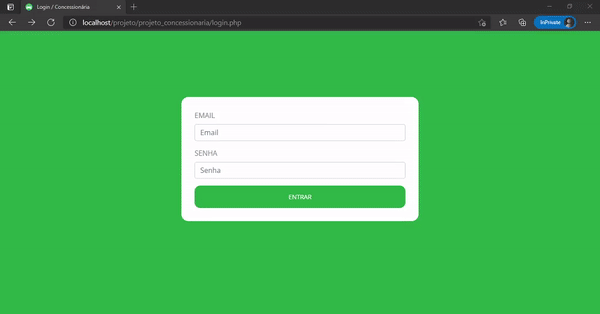

<h3 align="center">
    
</h3>

<p align="center"> :computer: <strong>Em progresso ...</strong> 🚧</p>

<p align="center"> 
   
  
  <a href="https://github.com/savio-2-lopes">
    
  </a>
 
 <a href="https://github.com/savio-2-lopes">
    
  </a>
</p>
 
<br>

## :pushpin: Índice

- [Sobre](#sobre-o-projeto)
- [Como Executar](#executar)
- [Tecnologias](#tecnologias)
- [Licença](#licenca)

<br>

<a id="sobre-o-projeto"></a>

## 💻 Sobre o projeto

:tada: Simples sistema de gerenciamento de uma concessionária em PHP

<br>

<a id="executar"></a>

## 🚀 Como executar o projeto

### Pré-requisitos

Antes de começar, você vai precisar ter instalado em sua máquina as seguintes ferramentas:
[Git](https://git-scm.com), [PHP](https://www.php.net/), [WAMPP](https://www.wampserver.com/en/) ou [XAMPP](https://www.apachefriends.org/pt_br/index.html).
Além disto é bom ter um editor para trabalhar com o código, como, por exemplo, o [VSCode](https://code.visualstudio.com/)

<br>

#### 🧭 Rodando a aplicação web

```bash

# Primeiramente, importe arquivo loja1.sql para seu banco de dados mySQL

# Entre na pasta htdocs do XAMPP (ou www no WAMP) e clone este repositório
$ git clone https://github.com/savio-2-lopes/simple_management-system_php.git

# Abra seu navegador em
$ http://localhost/simple_management-system_php


```

<br>

<a id="tecnologias"></a>

## 🛠 Tecnologias

As seguintes ferramentas foram usadas na construção do projeto:

- [Bootstrap](https://getbootstrap.com/)
- [PHP](https://www.php.net/)

<br>

<a id="licenca"></a>

## :memo: Licença

Este projeto está sob a licença do MIT. Veja a [página de licença](https://opensource.org/licenses/MIT) para mais detalhes.
